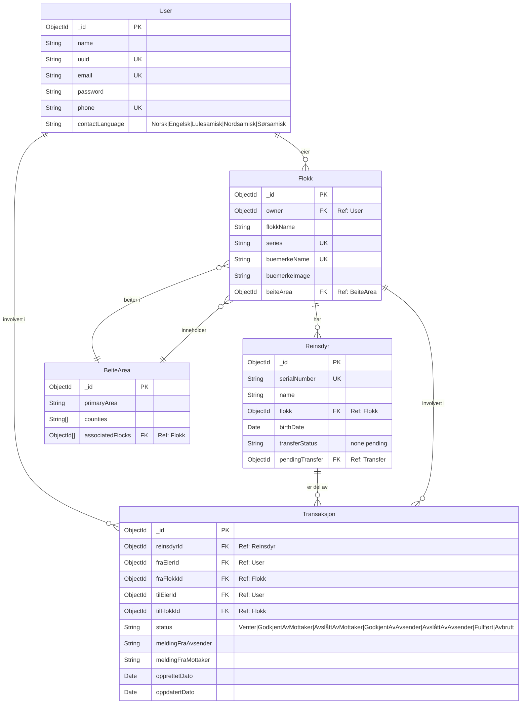
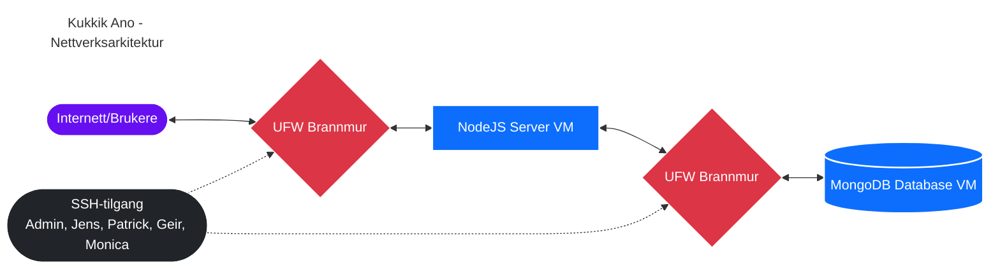

# SIMON TIJANIC - SAMISK OPPGAVE

## Tech Stack

| Teknologi | Kategori | Beskrivelse |
|-----------|----------|-------------|
| Node.js | Backend | JavaScript-runtime |
| Express.js | Backend | Webserver framework for håndtering av ruter og middleware |
| MongoDB | Database | NoSQL-database for lagring av data |
| Mongoose | Database | MongoDB ORM for Node.js, forenkler databaseoperasjoner |
| Express-session | Sikkerhet | Sesjonshåndtering for brukerautentisering |
| Bcrypt | Sikkerhet | Passordkrypteringsbibliotek for sikker brukerautentisering |
| EJS | Frontend | Template-engine for serverside-rendering |
| Dotenv | Verktøy | Håndtering av miljøvariabler |
| PM2 | DevOps | Process-handler for Node.js-applikasjoner i produksjon |
| UFW | DevOps | Brannmur for serversikkerhet |
| SSH | DevOps | Remote tilgang til server |

## ER Diagram:



## Nettverkskart


## API Dokumentasjon

### Autentisering

#### Autentiseringsendepunkter

| Endepunkt | Metode | Beskrivelse | Request Body | Response |
|-----------|--------|-------------|--------------|----------|
| `/auth/register` | POST | Registrer en ny bruker | `{ navn, epost, passord, telefon, kontaktspråk }` | `{ success: boolean, message: string, user: object }` |
| `/auth/login` | POST | Logg inn en eksisterende bruker | `{ epost, passord }` | `{ success: boolean, message: string, user: object }` |
| `/auth/logout` | POST | Logg ut den gjeldende brukeren | Ingen | `{ success: boolean, message: string }` |

### Flokk (Herd) Håndtering

#### Flokk Endepunkter

| Endepunkt | Metode | Beskrivelse | Request Body | Response |
|-----------|--------|-------------|--------------|----------|
| `/flokk/registerFlokk` | POST | Registrer en ny flokk | `{ flokkNavn, merkeNavn, beiteomraade, flokkSerienummer, merkeBildelenke }` og filopplasting | `{ success: boolean, message: string, flokk: object }` |
| `/flokk/getFlokk/:id` | GET | Hent detaljer om en spesifikk flokk | Ingen | `{ success: boolean, message: string, flokk: object, reinsdyr: array, pagination: object }` |

### Reinsdyr (Reindeer) Håndtering

#### Reinsdyr Endepunkter

| Endepunkt | Metode | Beskrivelse | Request Body | Response |
|-----------|--------|-------------|--------------|----------|
| `/reinsdyr/registerRein` | POST | Registrer et nytt reinsdyr | `{ navn, flokkId, fødselsdato, customSerienummer }` | `{ success: boolean, message: string, reinsdyr: object }` |
| `/reinsdyr/transferRein` | POST | Overfør et reinsdyr mellom flokker av samme eier | `{ reinsdyrId, targetFlokkId }` | `{ success: boolean, message: string, reinsdyr: object }` |

### Transaksjonssystem (Overføring av reinsdyr mellom eiere)

#### Transaksjon Endepunkter

| Endepunkt | Metode | Beskrivelse | Request Body | Response |
|-----------|--------|-------------|--------------|----------|
| `/reinsdyr/initiateTransfer` | POST | Start en overføringsforespørsel | `{ reinsdyrId, tilEierEpost, melding }` | `{ success: boolean, message: string, transaksjon: object }` |
| `/reinsdyr/respondTransfer` | POST | Svar på en overføringsforespørsel | `{ transaksjonId, godkjent, tilFlokkId, melding }` | `{ success: boolean, message: string, transaksjon: object }` |
| `/reinsdyr/confirmTransfer` | POST | Bekreft en overføring (siste steg) | `{ transaksjonId, godkjent }` | `{ success: boolean, message: string, transaksjon: object }` |
| `/reinsdyr/transactions` | GET | Hent alle transaksjoner for gjeldende bruker | Query params: `type, status` | `{ success: boolean, transaksjoner: array, gruppertTransaksjoner: object, totaltAntall: number }` |

### Søkefunksjonalitet

#### Søkeendepunkt

| Endepunkt | Metode | Beskrivelse | Query Params | Response |
|-----------|--------|-------------|--------------|----------|
| `/search` | GET | Søk blant eiere, flokker og reinsdyr | `q` (søkespørring) | `{ success: boolean, message: string, results: object, totalCount: number }` |

---

## Router-konfigurasjon

```javascript
const router = require("express").Router();

const userController = require("../Controllers/userController");
const registrationController = require("../Controllers/registrationController");
const transactionController = require("../Controllers/transactionController");

const authUser = require("../Middleware/authUser");

router.get("/", userController.getIndex);

router.get("/faq", userController.getFAQ);
router.get("/map", userController.getMap);
router.get("/database-info", userController.getDatabaseInfo);

router.get("/login", registrationController.getLogin);
router.get("/register", registrationController.getRegister);

router.post("/login", registrationController.postLogin);
router.post("/register", registrationController.postRegister);

router.post("/logout", registrationController.postLogout);

router.get("/reindeer-registration", authUser.isAuthenticated, registrationController.getReinsdyrRegister);
router.post("/reindeer-registration", authUser.isAuthenticated, registrationController.postReinsdyrRegister);
router.post("/reindeer/delete/:id", authUser.isAuthenticated, registrationController.postDeleteReinsdyr);

router.get("/flokk/create", authUser.isAuthenticated, registrationController.getFlokkCreation);
router.post("/flokk/create", authUser.isAuthenticated, registrationController.postFlokkRegister);

router.get("/search", userController.getSearch);

router.get("/flokk/:id", userController.getFlokk);

router.get("/transactions", authUser.isAuthenticated, transactionController.getTransaksjoner);

module.exports = router;
```


## Usage Guide

### Setup and Installation

1. **Clone the repository**

```bash
git clone https://github.com/simontijanic/Tverrfaglig-Kukkik-Prosjekt.git
cd Tverrfaglig-Kukkik-Prosjekt
```

2. **Install dependencies**

```bash
npm install
```

3. **Configure environment variables**

Create a `.env` file in the server directory with the following variables:

```
PORT=4000
SECRET="4237fdshb2j412j"
MONGOURL="mongodb://localhost:27017/KukkikAnoReinsdyrRegisterDB"
```

4. **Initialize the database with mock data (optional)**

```bash
sudo nano /Controllers/databaseController.js
Comment out // for mockdata()
```

5. **Start the application**

```bash
node index.js
```

For production, it's recommended to use PM2:

```bash
npm install -g pm2
pm2 start index.js
```
Her er den oppdaterte versjonen av databaseoppsettet basert på din implementasjon:  

---

### Database Schema  

1. **User** (Bruker)  
   - Informasjon om registrerte brukere  
   - UUID, kontaktopplysninger og foretrukket språk  

2. **Flokk** (Herd)  
   - Grupper av reinsdyr som tilhører en eier  
   - Knyttet til et spesifikt beiteområde  

3. **Reinsdyr** (Reindeer)  
   - Individuelle reinsdyr  
   - Tilhører en spesifikk flokk  
   - Har et unikt serienummer  

4. **BeiteArea** (Grazing Area)  
   - Definerer geografiske områder for reinbeite  
   - Inneholder lister over tilknyttede flokker  

5. **Transaksjon** (Transaction)  
   - Registrerer eierskapsendringer for reinsdyr  
   - Flermanns-godkjenningsprosess med statussporing  

---
